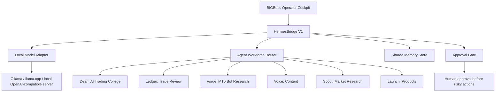

# Local Hermes + MiMo Installation Strategy

Date: 2026-06-08

## Decision

Use a local-first AI brain instead of a hosted VPS for the next phase.

The immediate build target is not a full MiMo download. The safer target is a `HermesBridge V1` layer that can call a local model runtime on this machine, preserve the BIGBoss agent workforce, and keep high-risk actions behind approval gates.

## Why Local First

- No monthly hosting cost.
- Private business memory stays on the desktop by default.
- GitHub remains the project backup and version history.
- The brain can start as reactive chat plus approval-gated tasks before becoming proactive.

## What The Hermes Tutorial Adds

The tutorial's VPS instructions should be adapted, not copied directly.

Useful concepts:

- Memory files for user profile, business facts, and agent learning.
- Skills as repeatable workflow instructions.
- Scheduled tasks for proactive daily/weekly work.
- GitHub backups for configuration and state.
- Least-privilege permissions.
- Human approval for risky commands, emails, publishing, money, and file deletion.

VPS-specific pieces to skip for now:

- Hostinger setup.
- Public internet exposure.
- Always-on cloud server assumptions.
- Broad account integrations on day one.

## Machine Check

Current local check:

- Machine: HP EliteBook 840 G3.
- RAM: about 8 GB.
- NVIDIA CUDA tooling: not detected through `nvidia-smi`.
- Docker: installed.
- Ollama client: installed, but no running Ollama service was detected.
- Free disk: enough space on `C:` and `E:` for development, but model downloads should still be deliberate.

This machine can host a local control layer and lightweight local models. It is not a good first target for full BF16 7B/8B model inference without quantization.

## MiMo Findings

Official MiMo is real and open-source.

- Xiaomi's MiMo repository describes MiMo-7B as a reasoning-focused model series.
- The official repo lists MiMo-7B-Base, MiMo-7B-SFT, MiMo-7B-RL-Zero, MiMo-7B-RL, and MiMo-7B-RL-0530.
- Official deployment examples use SGLang, vLLM, and Hugging Face Transformers with `trust_remote_code=True`.
- The official repo says they recommend their fork of vLLM and have not verified all other inference engines.
- Hugging Face model files for 7B/8B-class MiMo variants are large; one listed 7B/8B variant is about 18 GB before runtime overhead.

Conclusion: MiMo is a strong candidate for reasoning later, but it is not the first safe install on this laptop unless we use a proven quantized runtime and accept slow CPU inference.

Primary sources checked:

- XiaomiMiMo GitHub repository: https://github.com/XiaomiMiMo/MiMo
- XiaomiMiMo Hugging Face model card: https://huggingface.co/XiaomiMiMo/MiMo-7B-RL-0530
- MiMo technical report: https://arxiv.org/abs/2505.07608

## Recommended Local Brain Architecture

## Phased Install Path

### Phase A: Local Runtime Baseline

1. Start or repair Ollama locally.
2. Install one small reliable local model first.
3. Add a local model health check endpoint.
4. Connect the cockpit to the local model through a provider abstraction.

Success means the cockpit can ask the local model a simple question without any cloud API.

### Phase B: HermesBridge V1

1. Create a backend bridge service.
2. Add typed commands: `chat`, `route`, `create_task`, `read_memory`, `write_memory`.
3. Store memory locally in a predictable folder.
4. Add approval states for file edits, shell commands, GitHub pushes, email, publishing, and money-related actions.

Success means the cockpit can route a command to an agent and create an auditable local task.

### Phase C: Local Skills

Create BIGBoss skills as Markdown workflows:

- Morning market brief.
- Trade review.
- Backtest diagnosis.
- Course lesson builder.
- LinkedIn post builder.
- Offer builder.
- Weekly product roadmap.

Success means the brain can follow repeatable operating procedures instead of improvising every time.

### Phase D: MiMo Trial

Only after Phase A works:

1. Look for an official or trusted quantized MiMo package that fits local hardware.
2. Test small prompts against a limited local benchmark.
3. Compare MiMo against the current local model on trading education, reasoning, code, and planning prompts.
4. Keep MiMo only if it improves quality enough to justify speed and memory cost.

## Security Rules

- No live trading or order execution in V1.
- No secrets in chat, Git, docs, or browser local storage.
- Use one credential per tool when integrations are added.
- Start read-only for external integrations.
- Require approval for destructive file actions, publishing, email sends, GitHub pushes, payments, and account changes.
- Keep generated memory and logs out of public repos unless manually reviewed.
- Use `.env.local` for local-only configuration and keep it ignored.

## Next Implementation Slice

Build `HermesBridge V1` as a local backend adapter with:

- A local model provider interface.
- A health check for Ollama/local runtime.
- A safe mock provider fallback when no model is running.
- Local memory folder structure.
- Approval-gated task records.

This gets the AI brain architecture ready without betting the whole project on one heavy model install.
